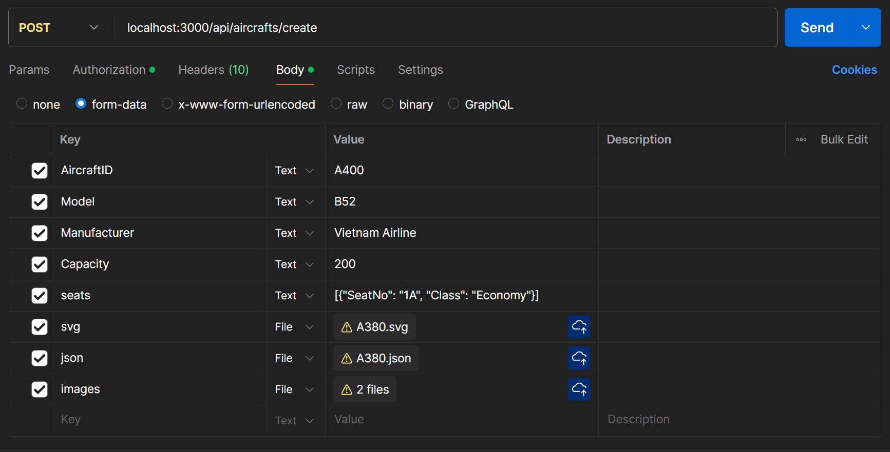

# API (Admin) documentation

- Use **Bearer `<token>`** for authentication.
- You can get the token by [logging in](API.md#login) as an admin.

## Table of Contents
- [Promotions](#promotions)
  - [Create Promotion](#create-promotion)
  - [Update Promotion](#update-promotion)
  - [Delete Promotion](#delete-promotion)
- [Flight](#flight)
  - [Update Flight](#update-flight)
  - [Create Flight](#create-flight)
- [Aircraft](#aircraft)
  - [Create Aircraft](#create-aircraft)
- [Statistics](#statistics)
  - [Tickets booked monthly in a year](#tickets-booked-monthly-in-a-year)

## Promotions
### Create Promotion
- **Endpoint:** `/api/promotions/create`
- **Method:** `POST`
- **POST Body:** JSON object with promotion details.
- **Description:** Creates a promotion.
- **Response:** Confirmation of promotion creation.
- **Example:** `/api/promotions/create`
- **Request Body:**
```json
{
  "Title": "Khuyến mãi tháng 12",
  "Content": "Giảm giá 50% cho tất cả các chuyến bay",
  "Amount": 50
}
```
- **Response:**
```json
{
  "message": "Thông tin đã được tạo thành công",
  "promotion": {
    "PromotionID": "PR001",
    "Title": "Khuyến mãi tháng 12",
    "Content": "Giảm giá 50% cho tất cả các chuyến bay",
    "Amount": 50
  }
}
```

### Update Promotion
- **Endpoint:** `/api/promotions/update/:PromotionID`
- **Method:** `PUT`
- **PUT Body:** JSON object with promotion details.
- **Description:** Updates a promotion.
- **Response:** Confirmation of promotion update.
- **Example:** `/api/promotions/update/PR001`
- **Request Body:**
```json
{
  "Title": "Khuyến mãi tháng 12",
  "Content": "Giảm giá 50% cho tất cả các chuyến bay",
  "Amount": 60
}
```

### Delete Promotion
- **Endpoint:** `/api/promotions/delete/:PromotionID`
- **Method:** `DELETE`
- **Description:** Deletes a promotion.
- **Response:** Confirmation of promotion deletion.
- **Example:** `/api/promotions/delete/PR001`
- **Response:**
```json
{
  "message": "Thông tin đã được xóa thành công"
}
```

## Flight
### Update Flight
- **Endpoint:** `/api/flights/update`
- **Method:** `PUT`
- **PUT Body:** JSON object with flight details.
- **Description:** Delays a flight.
- **Response:** Confirmation of flight delay.
- **Example:** `/api/flights/update`
- **Request Body:**
```json
{
  "flightID": "VN103",
  "DepTime": "2024-12-10T02:00:00.000Z",
  "BoardingTime": "2024-12-10T01:30:00.000Z",
  "Status": "Delayed",
  "DestID": "LAX"
}
```
- **Response:**
```json
{
  "message": "Flight delayed successfully",
  "flight": {
    "FlightID": "VN103",
    "Status": "Delayed",
    "DepTime": "2024-12-10T02:00:00.000Z",
    "ArrTime": "2024-12-08T16:00:00.000Z",
    "BoardingTime": "2024-12-10T01:30:00.000Z",
    "DepID": "HAN",
    "DestID": "LAX",
    "AircraftID": "A380",
    "OriginalDepTime": "2024-12-10T02:00:00.000Z",
    "OriginalArrTime": null,
    "OriginalBoardingTime": "2024-12-10T01:30:00.000Z"
  }
}
```

### Create Flight
- **Endpoint:** `/api/flights/create`
- **Method:** `POST`
- **POST Body:** JSON object with flight details.
- **Description:** Creates a flight.
- **Response:** Confirmation of flight creation.
- **Example:** `/api/flights/create`
- **Request Body:**
```json
{
  "Status": "Scheduled",
  "DepTime": "2024-12-10T02:00:00.000Z",
  "ArrTime": "2024-12-10T06:00:00.000Z",
  "BoardingTime": "2024-12-10T01:30:00.000Z",
  "DepID": "SGN",
  "DestID": "HAN",
  "AircraftID": "A380"
}
```
- **Response:**
```json
{
  "message": "Flight created successfully",
  "flight": {
    "Status": "Scheduled",
    "DepTime": "2024-12-10T02:00:00.000Z",
    "ArrTime": "2024-12-10T06:00:00.000Z",
    "BoardingTime": "2024-12-10T01:30:00.000Z",
    "DepID": "SGN",
    "DestID": "HAN",
    "AircraftID": "A380",
    "FlightID": "ON604"
  }
}
```

## Aircraft
### Create Aircraft
- **Endpoint:** `/api/aircrafts/create`
- **Method:** `POST`
- **Description:** Creates an aircraft.
- **Response:** Confirmation of aircraft creation.
- **Example:** `/api/aircrafts/create`
- 

## Statistics
### Tickets booked monthly in a year
- **Endpoint:** `/api/statistics/monthly`
- **Method:** `GET`
- **Description:** Get the number of tickets booked monthly in a year.
- **Response:** Number of tickets booked monthly in a year.
- **Example:** `/api/statistics/booking/monthly?year=2024`
- **Response:**
```json
{
  "year": "2024",
  "monthlyStatistics": [
    {
      "month": 1,
      "bookingCount": 0
    },
    {
      "month": 2,
      "bookingCount": 0
    },
    {
      "month": 3,
      "bookingCount": 0
    },
    {
      "month": 4,
      "bookingCount": 0
    },
    {
      "month": 5,
      "bookingCount": 0
    },
    {
      "month": 6,
      "bookingCount": 0
    },
    {
      "month": 7,
      "bookingCount": 0
    },
    {
      "month": 8,
      "bookingCount": 0
    },
    {
      "month": 9,
      "bookingCount": 0
    },
    {
      "month": 10,
      "bookingCount": 0
    },
    {
      "month": 11,
      "bookingCount": 0
    },
    {
      "month": 12,
      "bookingCount": 2
    }
  ]
}
```